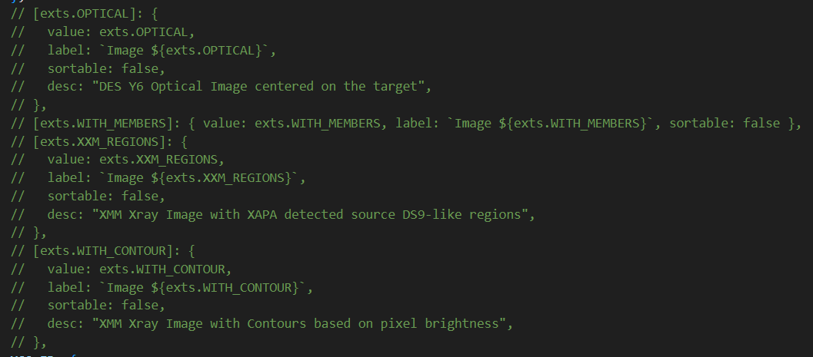

### Requirements
 - `Python 3.9+`, with `numpy`, `pandas` and `pymongo` (if not already installed in Anaconda, you can do it in the environment section)
 - Visual Studio Code as Anaconda extension
 - CSV file with the data you are going to put in the survey (remember to include an `XCS_ID` column with as data the row number to identify each object in the survey uniquely)
 - Object images, previously downloaded and modified  


## Create the survey
Open a new terminal in Visual Studio, change the directory to XCS_WB/survey_generator and run this command to check if the survey generator Python script works:
```
python ./new_survey.py -h
```

Input in powershell:
``` 
$env:DB_USERNAME = "DES_MASTER"
$env:DB_PASSWORD = "ZwernemannSimply1835GiuseppinaMonicaBoris"
```

Input this command:
``` 
python ./new_survey.py -n nameofsurvey -c NAME_OF_SURVEY -s /path to the CSV file
```

If it worked, you should be able to open OCTAVIUS and see your survey with the data you provided but with empty images. You can use a local app such as https://localhost:3000/xcs_portal/`SURVEY_NAME`


## Configure the images

Find your newly created survey struct file in `./XCS_WB/ui/src/Routes/[nameOfYourSurvey]/[name-of-your-survey-struct.js`, as in this survey example:


Currently, the file will contain four default images:


Since your images are in a Cloud storage, you can just ignore them and put a double slash on each line:




Lastly, find the `format_url` file for your survey in `./XCW_WB/ui/src/Utils/helpers/format-[your-survey-name]-url.js`.

From Azure Blob, you can get a link to share your stored image. It needs to be sent, together with a zip file of all your pictures, to reese.wilkinson@sussex.ac.uk. He will create a new link that you will need to copy, as for example:

``` 
const formatImageUrl = (datum, size, ext) =>
  `https://xcsresearchgroup.blob.core.windows.net/xapa-test-survey-images/XAPA_COMP_Images/${datum?.XCS_ID}_XAPA_COMP.png`;
```

The `${datum?.XCS_ID}_XAPA_COMP.png` part indicates the name of your images, so you must name them so that OCTAVIUS can recognise the XCS_ID column.

## Store OCTAVIUS images locally
Another way to show images in the survey you just created is by storing them locally. It is not ideal for many pictures but is a good way to check if everything is set up properly. 

Copy the path where the images are stored and in Visual Studio, change the directory. For example:

``` 
PS C:\Users\giuli> Set-Location .\OneDrive\Desktop\Astrophysics` MPhys\YPS C:\Users\giuli\OneDrive\Desktop\Astrophysics MPhys\Year 4\Dissertation\Mag7_images
```

Then run the command:

``` 
python -m http.server
```

It should appear something like this: 

``` 
Serving HTTP on :: port 8000 (http://[::]:8000/) ...
```

You can then go to the port shown in the message, in this case, http://localhost:8000/ and check that it contains the images. After that, you can go to the `format_url` file and change the link to something like this:

``` 
`http://localhost:8000/Mag7_${datum?.XCS_ID}.png`
```

If it doesn't show the images, check the `index.js` file in the same folder has the same formatImageUrl name as your `format_url` file, If not, you need to import it correctly in two different files: the `image-manipulation-modal.js` and the `image.jsx` in the `component` folder where your survey is stored. 
