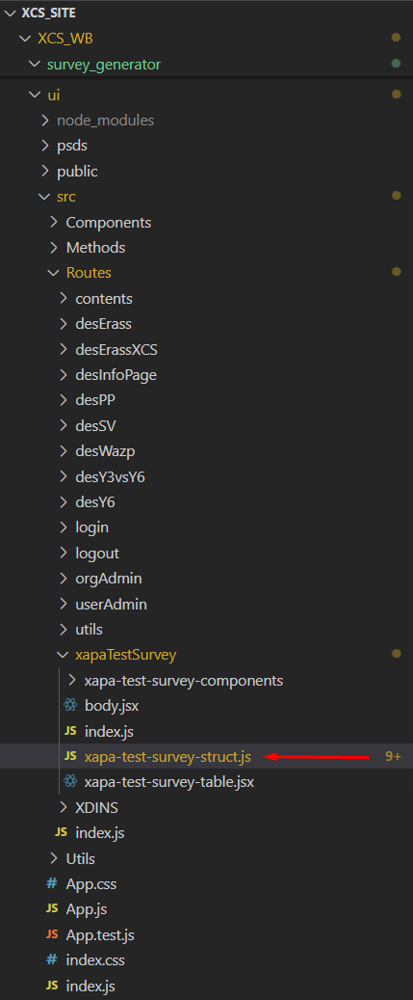
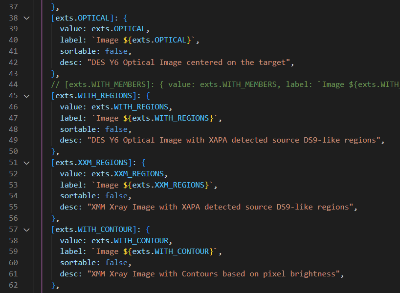
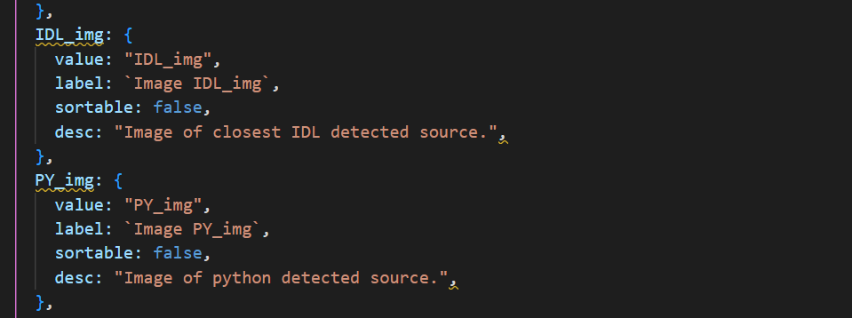
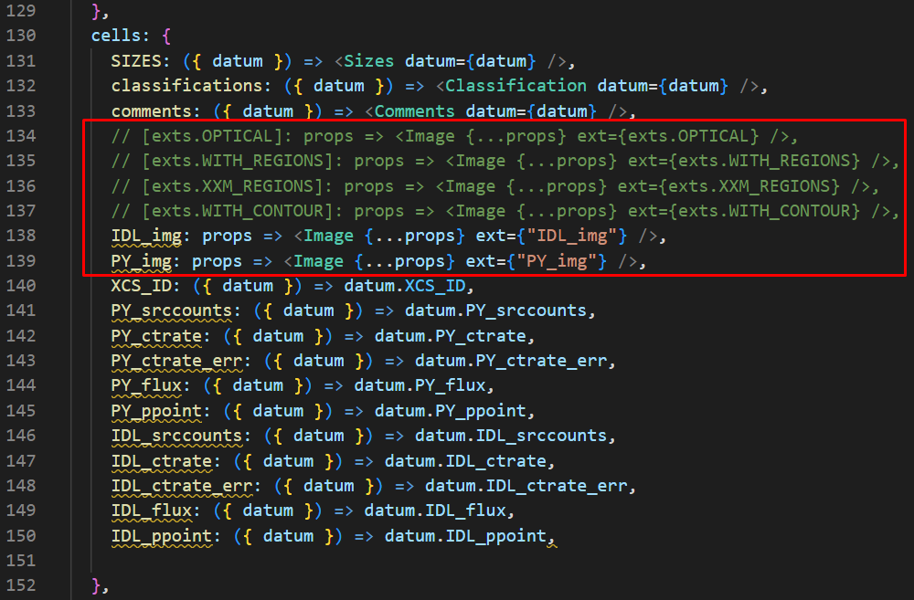

### Requirements
 - `Python 3.9+`, with `numpy`, `pandas` and `pymongo` (if not already installed in Anaconda, you can do it in the environment section)
 - Visual Studio Code as Anaconda extension
 - CSV file with the data you are going to put in the survey (remember to include an `XCS_ID` column with as data the row number to identify each object in the survey uniquely)
 - Object images, previously downloaded and modified  


## Create the survey
Open a new terminal in Visual Studio, change the directory to XCS_WB/survey_generator and run this command to check if the survey generator Python script works:
```
python ./new_survey.py -h
```

Input in powershell:
``` 
$env:DB_USERNAME = "DES_MASTER"
$env:DB_PASSWORD = "ZwernemannSimply1835GiuseppinaMonicaBoris"
```

Input this command:
``` 
python ./new_survey.py -n nameofsurvey -c NAME_OF_SURVEY -s /path to the CSV file
```

If it worked, you should be able to open OCTAVIUS and see your survey with the data you provided but with empty images. You can use a local app such as https://localhost:3000/xcs_portal/`SURVEY_NAME`


## Configure the images

Find your newly created survey struct file in `./XCS_WB/ui/src/Routes/[nameOfYourSurvey]/[name-of-your-survey-struct.js`, as in this survey example:



Currently, the file will contain four default images:



Since your images are in a Cloud storage, you can just ignore them and put a double slash on each line:



Ensure:
- `value` matches the `key` 
- `label` is what will be shown as column header
- `sortable` must be false
- `desc` is a short description shown when the user hovers their mouse over the `label`

Near the bottom, there will be the `cells` implementations of the values, from which you should remove the default image values and replace them with your own.
As an example:
``` 
value: props => <Image {...props} ext={"value"}>
```



Lastly, find the `format_url` file for your survey in `./XCW_WB/ui/src/Utils/helpers/format-[your-survey-name]-url.js`

``` 
const formatImageUrl = (datum, size, ext) =>
  `https://xcsresearchgroup.blob.core.windows.net/xapa-test-survey-images/XAPA_COMP_Images/${datum?.XCS_ID}_XAPA_COMP_ext_${ext}.png`;
```

Change the string formatting to what your images would be called, noting that:
- `datum` is a struct containing the values for each row in the table, use it to access the corresponding value from the schema you uploaded, namely the `XCS_ID` of the row
- `size` is the current size selected by the user from the dropdown, which doesn't need to be modified
- `ext` is the `value` from the table struct file that was modified previously, use this to know which image it should be. In the example, it is used to distinguish between Python images and IDL images

